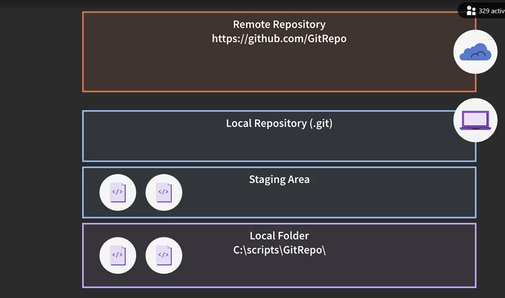

Step 1:
Intall git software from offical website into local destop(windows)
https://git-scm.com/downloads/win
Version check <git --version>

Step 2:
Navidate to project root folder & run below the command. it will Initialize empty Git repository locally. 
<git init>

Step 3:
After execude below commad to do "STAGING" activity
i)  for a specific file
<git add "Source_code_version.txt">
ii) for all the files
<git add .>

Step 4:
Run STATUS command just to see how our repository doing
<git status>

Step 5:
Run COMMIT command to push into loacl repository
<git commit -m "Testing_Purpose">

Step 6:
Make sure root project is synch with Remote repository. if not
<git remote add origin https://github.com/Danieldj007/Githup_Trianing_Project.git>
To push into Remote repository from loacl repository 
<git push>